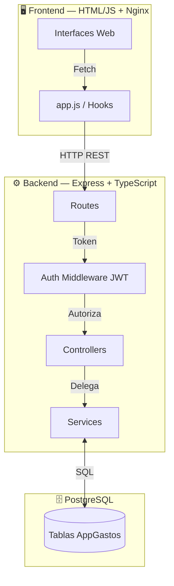

<div align="center">

# 💰 AppGastos

**Administrador de Finanzas Personales — Gestiona tus gastos, ingresos y ahorros en un solo lugar**

[](./docs/architecture.md)
[](https://nodejs.org/)
[](https://www.typescriptlang.org/)
[](https://expressjs.com/)
[](https://www.postgresql.org/)
[](./docker-compose.yml)
[](#-licencia)

</div>

---

## 🧭 Tabla de Contenidos

| Sección | Descripción |
|---------|-------------|
| [✨ Características](#-características) | Qué hace AppGastos |
| [🧩 Tech Stack](#-tech-stack) | Tecnologías utilizadas |
| [🏗️ Arquitectura](#️-arquitectura) | Cómo está estructurado el sistema |
| [📡 API Endpoints](#-api-endpoints) | Documentación de rutas REST |
| [📂 Estructura del Proyecto](#-estructura-del-proyecto) | Organización de carpetas |
| [🚀 Inicio Rápido](#-inicio-rápido) | Cómo levantar el proyecto |
| [🐳 Docker](#-docker) | Despliegue con contenedores |
| [⚙️ Variables de Entorno](#️-variables-de-entorno) | Configuración |
| [🗺️ Roadmap](#️-roadmap) | Próximas mejoras |
| [📄 Licencia](#-licencia) | Información legal |

---

## ✨ Características

> Una solución completa para el control de tus finanzas personales, con autenticación segura y datos aislados por usuario.

- 🔐 **Autenticación Segura** — Registro y login con encriptación **Bcrypt** y sesiones **JWT**.
- 💸 **Gestión de Gastos** — Registra, edita y elimina tus gastos con categorización.
- 💵 **Control de Ingresos** — Lleva el seguimiento de tus fuentes de ingresos.
- 🐖 **Metas de Ahorro** — Define y actualiza tus objetivos de ahorro.
- 📊 **Dashboard Inteligente** — Resumen consolidado de tu situación financiera.
- 📈 **Analíticas** — Visualiza tendencias y estadísticas de tu comportamiento.
- 🕘 **Historial Completo** — Consulta el registro cronológico de tus movimientos.
- 👤 **Aislamiento por Usuario** — Cada usuario solo accede a su propia información.

---

## 🧩 Tech Stack

### 🔹 Backend

| Tecnología | Uso |
|------------|-----|
|  | Entorno de ejecución del servidor |
|  | Framework HTTP y enrutamiento |
|  | Tipado estático y seguridad |
|  | Base de datos relacional (`pg`) |
|  | Autenticación por tokens |
|  | Hashing de contraseñas |

### 🔹 Frontend *(Estado actual)*

| Tecnología | Uso |
|------------|-----|
|  | Estructura de la interfaz |
|  | Lógica del cliente (Vanilla) |
|  | Servidor web estático (Docker) |

### 🔹 DevOps & Herramientas


---

## 🏗️ Arquitectura

AppGastos sigue un patrón **Cliente-Servidor** con una arquitectura **MVC por capas** que separa claramente las responsabilidades y reduce el acoplamiento.



> 📖 **¿Quieres ver los diagramas de flujo de autenticación, manejo de errores y el modelo estructural?**
>
> 👉 [**Lee la documentación de arquitectura completa**](./docs/architecture.md)

**Principios clave del diseño:**

- ✅ **Controllers livianos** — Manejan el ciclo HTTP en menos de 15 líneas.
- ✅ **Services pesados** — Toda la lógica de negocio y consultas a BD.
- ✅ **Frontend pasivo** — Solo recibe y renderiza, sin cálculos complejos.

---

## 📡 API Endpoints

Todas las rutas —excepto `/auth`— requieren un **Bearer Token JWT** en el header `Authorization`.

### 🔓 Autenticación — Pública

| Método | Ruta | Descripción |
|--------|------|-------------|
| `POST` | `/auth/register` | Registrar un nuevo usuario |
| `POST` | `/auth/login` | Iniciar sesión y obtener token |

### 🔒 Recursos Protegidos

| Método | Ruta | Descripción |
|--------|------|-------------|
| `GET` | `/dashboard/summary` | Resumen financiero consolidado |
| `GET` | `/analytics` | Estadísticas y tendencias |
| `GET` | `/history` | Historial cronológico de movimientos |
| `GET` `POST` `PUT` `DELETE` | `/expenses` | CRUD completo de gastos |
| `GET` `POST` `PUT` `DELETE` | `/incomes` | CRUD completo de ingresos |
| `GET` `PUT` | `/savings` | Consulta y actualización de ahorros |

#### 📝 Formato de Respuesta Estandarizado

```json
// ✅ Éxito
{ "status": "success", "data": { ... } }

// ❌ Error
{ "status": "error", "message": "Token expirado." }
```

---

## 📂 Estructura del Proyecto

```
AppGastos/
├── 📂 backend/                  # API REST en Node.js + TypeScript
│   ├── 📂 src/
│   │   ├── 📂 controllers/      #   Entrada/Salida HTTP (req, res)
│   │   ├── 📂 services/         #   Lógica de negocio y BD
│   │   ├── 📂 routes/           #   Definición de endpoints
│   │   ├── 📂 models/           #   Modelos y validación de datos
│   │   ├── 📂 middleware/       #   Auth JWT y validaciones
│   │   ├── 📂 db/
│   │   │   ├── pool.ts          #     Conexión PostgreSQL
│   │   │   └── 📂 migrations/   #     Scripts SQL de esquema
│   │   ├── app.ts               #   Configuración de Express
│   │   └── server.ts            #   Punto de entrada
│   ├── Dockerfile
│   └── package.json
├── 📂 frontend/                 # Cliente web
│   ├── 📂 public/
│   │   ├── index.html           #   Dashboard principal
│   │   ├── login.html           #   Pantalla de acceso
│   │   ├── history.html         #   Historial de movimientos
│   │   └── app.js               #   Lógica del cliente
│   └── Dockerfile               #   Nginx
├── 📂 docs/
│   └── architecture.md          #   Diagramas y detalles técnicos
├── docker-compose.yml           #   Orquestación de servicios
├── .env.example                 #   Variables de entorno de ejemplo
└── README.md
```

---

## 🚀 Inicio Rápido

### 📋 Requisitos Previos

- **[Node.js](https://nodejs.org/)** v20 o superior
- **[PostgreSQL](https://www.postgresql.org/)** 16+ (local o vía Docker)
- **npm** (incluido con Node.js)

### 🔧 Instalación Local

```bash
# 1. Clona el repositorio
git clone <url-del-repo>
cd AppGastos

# 2. Configura tus variables de entorno
cp .env.example .env
#    ↳ Edita .env con tus credenciales

# 3. Instala y ejecuta el backend
cd backend
npm install
npm run dev      # Modo desarrollo (hot-reload)
# o
npm run build && npm start   # Modo producción
```

| Script | Descripción |
|--------|-------------|
| `npm run dev` | Servidor de desarrollo con recarga automática |
| `npm run build` | Compila TypeScript a `dist/` |
| `npm start` | Ejecuta la versión compilada |

La API estará disponible en **`http://localhost:3000`** 🎉

---

## 🐳 Docker

La forma más rápida de levantar todo el stack (API + Frontend + Base de Datos):

```bash
# Levanta todos los servicios en segundo plano
docker-compose up -d

# Ver los logs en vivo
docker-compose logs -f

# Detener todo
docker-compose down
```

### 🌐 Puertos de los Servicios

| Servicio | Puerto | URL |
|----------|--------|-----|
| 🟢 **API Backend** | `3000` | `http://localhost:3000` |
| 🔵 **Frontend Web** | `8080` | `http://localhost:8080` |
| 🟣 **PostgreSQL** | `5432` | `localhost:5432` |

---

## ⚙️ Variables de Entorno

Configura tu archivo `.env` basándote en [`.env.example`](./.env.example):

```env
PORT=3000
DB_HOST=db
DB_PORT=5432
DB_NAME=appgastos
DB_USER=postgres
DB_PASSWORD=postgres
JWT_SECRET=change_this_to_a_secure_random_string
```

> ⚠️ **Importante:** En producción, usa siempre una contraseña segura y un `JWT_SECRET` aleatorio robusto.

---

## 🗺️ Roadmap

- [x] Backend funcional con CRUD de gastos, ingresos y ahorros
- [x] Autenticación JWT + Bcrypt
- [x] Aislamiento de datos por usuario
- [x] Dashboard y analíticas
- [x] Despliegue con Docker Compose
- [ ] 🔄 Migración del frontend a **React**
- [ ] 🎨 Integración con **Ant Design** y **TailwindCSS**
- [ ] 📱 App móvil responsive
- [ ] 🔔 Notificaciones y recordatorios

---

## 📄 Licencia

Este proyecto está bajo la licencia **MIT**.

---

<div align="center">

<sub>🛠️ Proyecto construido siguiendo principios **SOLID** y clean architecture.</sub><br>
<sub>📄 Código en **Inglés** · 📚 Documentación en **Español**</sub>

**⭐ Si te resulta útil, ¡no dudes en dejar una estrella!**

</div>
