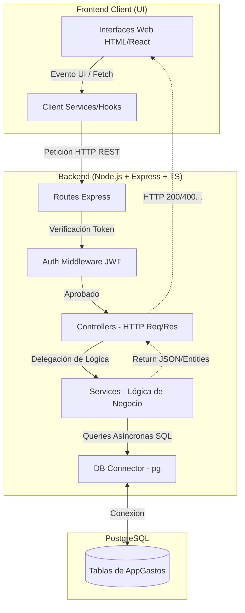
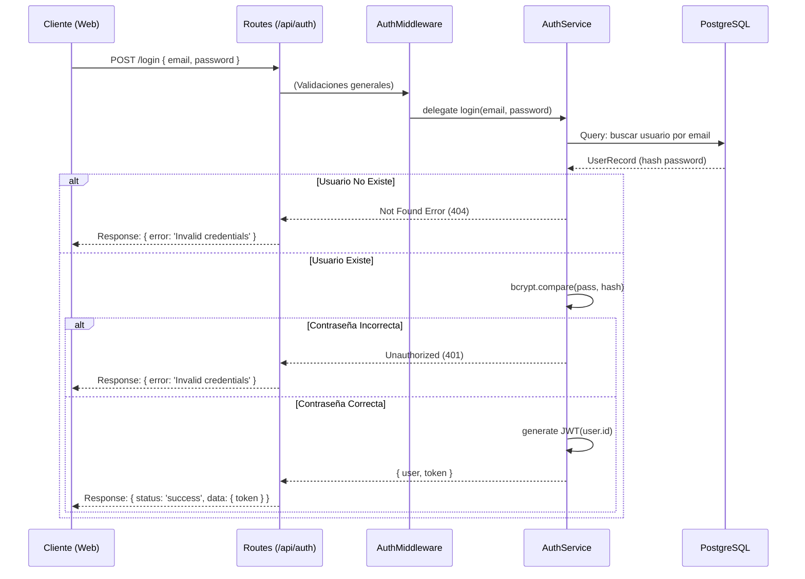

# Arquitectura y Diagramas de Flujo - AppGastos

Este documento ilustra la arquitectura técnica y los flujos de datos operativos dentro del ecosistema de **AppGastos**, basándose en las regulaciones de la carpeta `.agent/skills/`.

## 1. Diagrama de Arquitectura de Alto Nivel

El sistema sigue una arquitectura estricta Cliente-Servidor. El cliente envía peticiones REST JSON al Backend (Express.js), el cual procesa esa petición a través de enrutadores, controladores y luego la pasa a la capa de servicios para interactuar con la Base de Datos.



## 2. Flujo de Autenticación de Usuario (Login)

Flujo representativo al intentar iniciar sesión en el proyecto, aplicando las políticas de encriptación (**Bcrypt**) y la creación del Token de sesión (**JWT**).



## 3. Modelo Estructural Deseado (Boilerplate Rules)

Acorde a las Skills del agente (`estructura-proyectos` y `backend-prisma`), la organización del sistema respeta los principios `SOLID` reduciendo el acomplamiento:

*   **Controllers Livianos**: El controlador se encarga de manejar el ciclo HTTP `(req, res)` en **menos de 15 líneas** de código.
*   **Servicios Pesados**: El archivo `.service.ts` maneja las promesas directamente, ejecuta agrupaciones y lógica fuerte antes de devolver la data estructurada al controller.
*   **Gestión Eficiente**: El frontend *NUNCA* debe hacer cálculos de lógica de negocios masivos ni agrupaciones complejas en listas enormes. Solo recibe y renderiza.

## 4. Tipado y Manejo de Errores

Siempre aseguramos un retorno estandarizado para las respuestas hacia el frontend.

```typescript
// ✅ Caso de Éxito
{ 
  status: 'success', 
  data: { expenses: [...], total: 1000 } 
}

// ❌ Caso de Error
{ 
  status: 'error', 
  message: 'Token expirado, por favor inicie sesión de nuevo.' 
}
```

```mermaid
flowchart LR
    Error[Excepción o Error Controlado] --> TryCatch[Try/Catch Global o Controller]
    TryCatch --> Log[Registro en consola ej. '[AuthService] error...']
    Log --> Format[Formateo de JSON {status: error, message:...}]
    Format --> Http[Status Code 400, 401 o 500]
```
